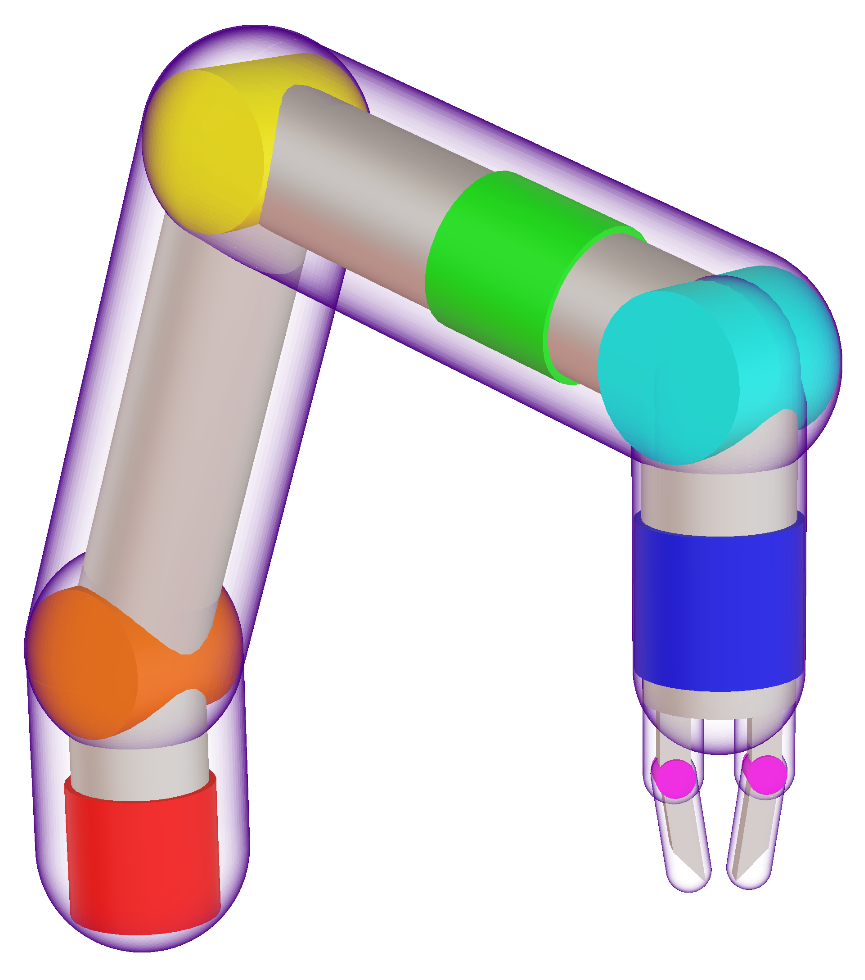
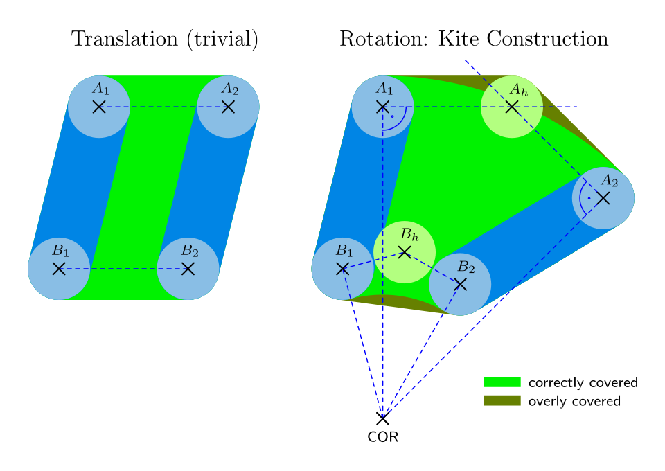
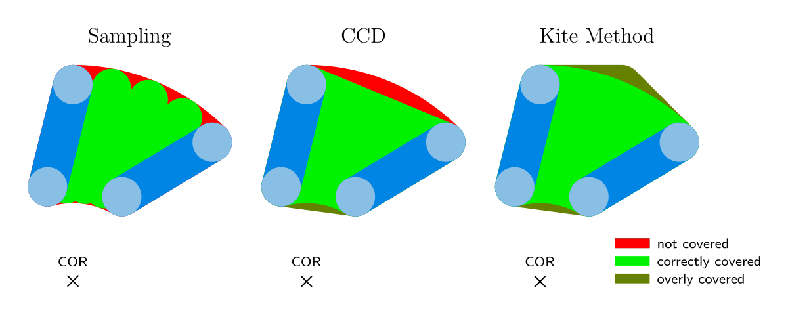
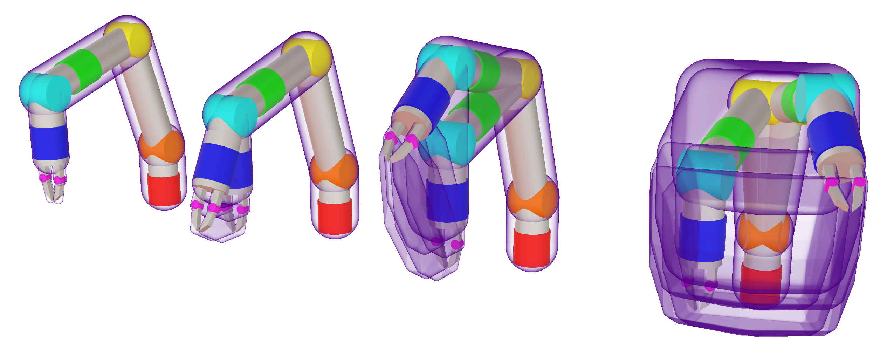
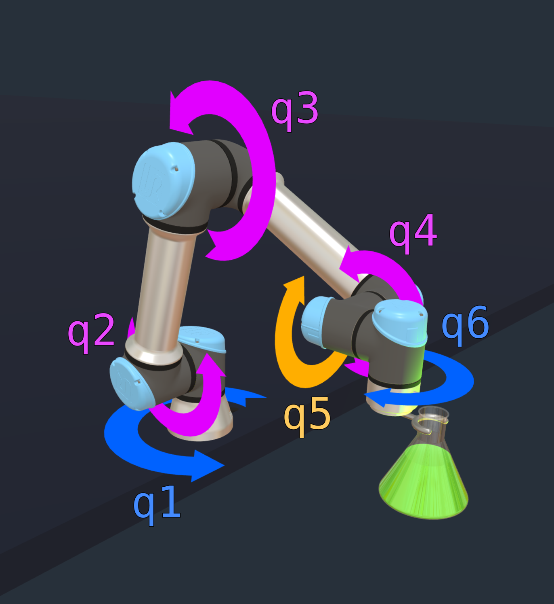
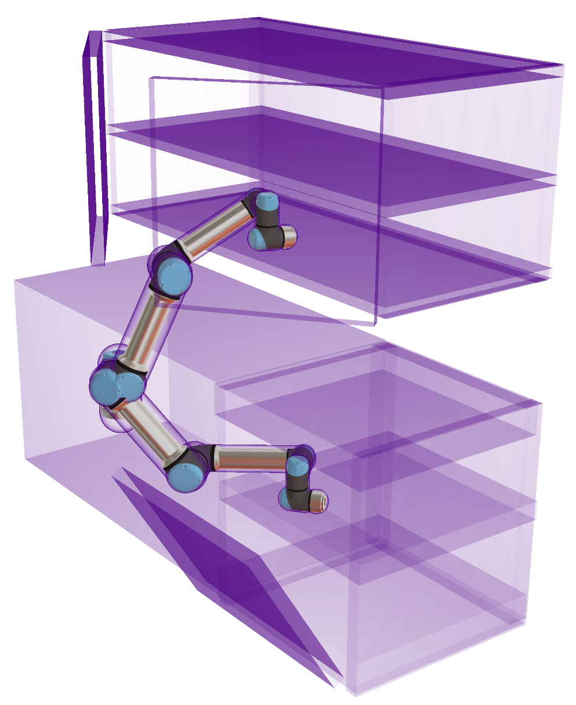
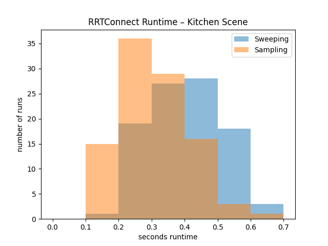
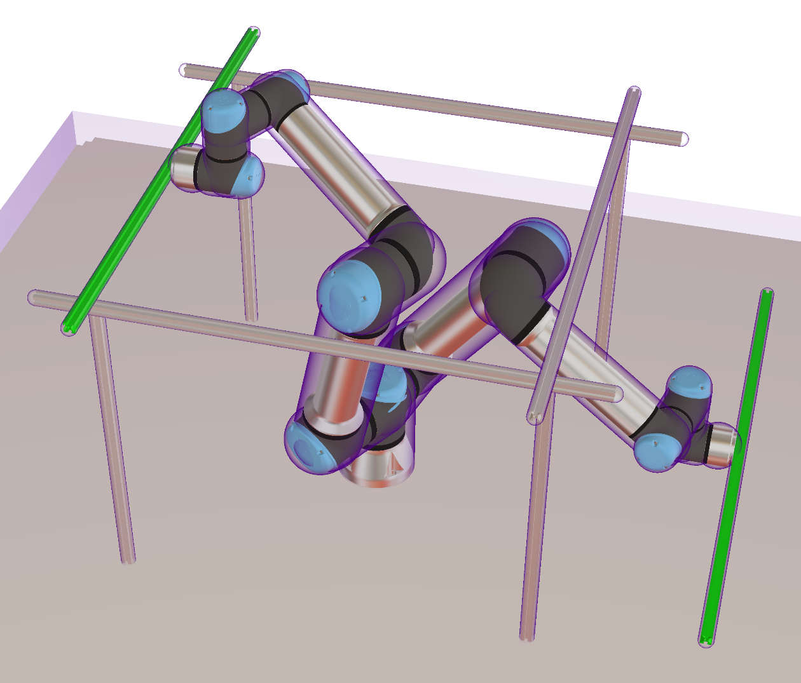
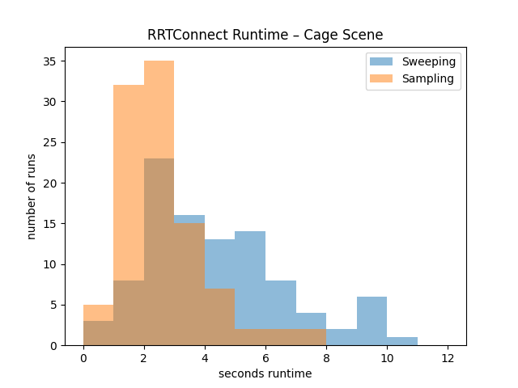

# Kite Motion Planner
Proof-of-Concept Motion Planner for Robot Arms, written in C++

## About

This project is an experimental successor to the [Gestalt Motion Planner](https://github.com/mqnc/gestalt-motion-planner). It is centered around a concept that allows for very efficient motion validation that can theoretically guarantee collision-free motion (in contrast to the usual sampling or linear continuous collision detection approaches).

## Project Status

Although originally developed for production use later on, this planner is still in an experimental state. The author is no longer working at Gestalt Automation GmbH where the project was initially started and is now publishing it as a hobby (with permission).

## License

This project is released under the [PolyForm Noncommercial License 1.0.0](https://polyformproject.org/licenses/noncommercial/1.0.0/). For a commercial license contact [Gestalt Automation GmbH](https://www.gestalt-automation.com/en/contact).

## Key Concepts

Most of the basic functionality of this planner is taken from [the previous version](https://github.com/mqnc/gestalt-motion-planner). In essence, [bullet3](https://github.com/bulletphysics/bullet3) is used for collision detection, [OMPL](https://ompl.kavrakilab.org) is used for path finding and [ruckig](https://github.com/pantor/ruckig) is used for path smoothing to get jerk-limited trajectories.

This section discusses the two main ideas that are tested in this project.

### Hierarchical Sweeping

The core concept is somewhat similar to what is outlined in [this paper](https://www.cs.unc.edu/techreports/03-038.pdf) but utilizes some tweaks that make it slightly more conservative but much more efficient.

We approximate each moving part with convex hulls around one or more equally-sized spheres.

<!--  -->
<p align="center"></p>

In order to check a motion for collision, we start at the leaves of our kinematic tree. Let us consider a single finger which is modeled by a capsule shape: a convex hull around two spheres located at point $A$ and point $B$. We now want to move this finger using a joint from state 1 to state 2. For this we construct the volume that the finger will sweep through during the motion. We can then check this sweeping volume for collisions with the environment.

<p align="center"></p>

If the joint is prismatic, we simply have to move points $A$ and $B$ along the translation axis and then construct the convex hull around $A_1$, $A_2$, $B_1$ and $B_2$. For revolute joints, we rotate each point about the joint axis from state 1 to state 2 but in addition to that we need a helper point ($A_h$ and $B_h$ in the sketch). We find it where the motion tangent at the start location of a point and the motion tangent at the target location of that point intersect. We then also include spheres around all helper points in the convex hull that covers our sweeping volume. This ensures that the resulting shape is guaranteed to completely enclose the finger at all times during motion.

Contrast this with traditional sampling and continuous collision detection approaches which can both result in missed collisions in the red areas:

<p align="center"></p>

Now we have to propagate our way up the robot joint by joint to the robot base, always sweeping every volume we have constructed further down. As an example, here is a 6DoF robot where wrist, elbow and base each move by 30° and the step-by-step sweeping volume construction from end effector to base:

<p align="center"></p>

This covers the main idea. For further discussion, check out [discussion](docs/sweep_discussion.md).

### Joint Projection Constraints

Some tasks require that the end effector keeps a certain orientation, for instance when holding a liquid. There are two popular approaches to deal with this:

1) Sampling lots of poses and keeping only those within some tolerance around the target orientation — this is computationally very expensive and also very unsexy.
2) Sampling in Cartesian space and computing the IK for every sample — also expensive and configuration flips have to be detected and avoided.

In this planner, we keep the end effector upright by working in a lower-dimensional slice of the joint space. Consider the following configuration:

<p align="center"></p>

If we keep both `q5` as well as the sum `q2 + q3 + q4` constant, the flask can only stay perfectly level. This can be specified via the following list of linear constraint vectors: `[[0, 0, 0, 0, 1, 0], [0, 1, 1, 1, 0, 0]]`, meaning

```
0*q1 + 0*q2 + 0*q3 + 0*q4 + 1*q5 + 0*q6 = const.
0*q1 + 1*q2 + 1*q3 + 1*q4 + 0*q5 + 0*q6 = const.
```

Additionally, we can also define `q1 - q6` to remain constant (`[1, 0, 0, 0, 0, 0, -1]`), which would also fix the rotation of the flask about the vertical axis and thus completely fix its orientation in space during motion.

Each constraint vector restricts the robot motion to stay within a certain hyper plane (orthogonal to the vector) in joint space. The constants on the right side are determined from the current robot pose.

The advantages of this approach are:

* It works in joint space so it can even drive through singularities without issues.
* It even accelerates planning since it reduces the dimensionality of the search space.

The only disadvantage is that it only works for certain orientations, certain robot kinematics and when the robot is mounted horizontally (including upside down). Although that might seem very restrictive, it should cover the majority of use cases.

## Results

In this section only hierarchical sweeping is evaluated since joint projection constraints were already successfully tested in the previous planner and no effort was made to implement alternative approaches for comparison.

Also, disclaimer: These results are in no way comprehensive. Apart from repetition with different random seeds, no measures were taken to assure rigorous performance measurements. However, they should convey an impression on the order of magnitude.

### Kitchen

As a somewhat objective benchmark for comparison, the kitchen scene from [MotionBenchMaker](https://github.com/KavrakiLab/motion_bench_maker) was selected:

<p align="center"></p>

The robot has to move from the dishwasher to the cupboard, both start and target are located in very narrow spaces with little wiggle room.

Here we compare the program runtime invoking RRTConnect until a path is found, no trajectory refinement. Both sampling and sweeping use a range of 0.2&hairsp;rad (Euclidean distance in joint space). Sampling was done using a maximum stepwidth of 1° for each joint. Sweeping always actuates just two joints at a time and does not optimize convex hulls. It does not add any additional corners of tested cuboids in joint space to the exploration tree. The program is run 100 times with different random seeds, the plot below shows the runtime distribution for both algorithms.

<p align="center"></p>

Sampling took an average of 0.3&hairsp;s while Sweeping took an average of 0.4&hairsp;s. However, since setup time was measured as well, a more difficult planning problem is needed for better comparison so that most of the time is spent planning.

In order to evaluate how reliable the motion checking methods worked, they were both compared to a sampling check with 0.1° step size, which is taken as ground truth.

During the RRTConnect exploration phase, in 15 out of 129456 tested motions (about 1 in 8600), 1° step size sampling missed collisions that 0.1° sampling found. For sweeping, in 13602 out of 222347 motions (about 1 in 16), it overzealously reported collisions where 0.1° sampling did not find any.

When refining the found trajectory afterwards, waypoints are moved around until they almost collide, which increases the number of false reports significantly. 3138 out of 238791 (about 1 in 76) 1° sampling motion checks missed a collision. Sweeping falsely detected 66409 collisions in 479146 motions (about 1 in 7).

Note that a missed collision is much worse than a falsely reported collision since it means the real robot might actually collide with the environment. The collision problem can be mitigated for sampling by using a fine enough step size or a large enough safety margin around the robot. However, it is difficult to pick a step size or a margin that guarantees collision freedom while not being overly conservative.

### Cage

In an attempt to highlight the strengths of the hierarchical sweeping approach, the following scene was designed:

<p align="center"></p>

The planner has to maneuver the beam through the cage from the green pose to the other green pose. The space is not as tight and collisions can easily be missed with long and slim beams that move far with small joint motion steps.

<p align="center"></p>

Here, 1° sampling took around 2.7&hairsp;s while sweeping took around 4.5&hairsp;s on average (this time only 1 joint actuated at a time), so sweeping has 67% extra runtime.

Interestingly in only 1 out of 17500 motions, a collision has been missed by 1° sampling during exploration, about half as bad as the kitchen scenario. Sweeping overreported about 1 in 12 collisions.

### Tweaking Attempts

The sweeping settings in the above trials were the best that were found. Some tweaks that were proposed in the [discussion](docs/sweep_discussion.md) were mostly slowing down sweeping further:

| Method | Average RRTConnect Time |
|---|:---:|
| sampling; 1° step size | 2.8&hairsp;s |
| sweeping; 1 joint at a time; no hull optimization; no AABB corners | 4.6&hairsp;s |
| sweeping; 2 joints at a time; no hull optimization; no AABB corners | 6.2&hairsp;s |
| sweeping; 3 joints at a time; no hull optimization; no AABB corners | 6.4&hairsp;s |
| sweeping; 6 joints at a time; no hull optimization; no AABB corners | >60&hairsp;s |
| sweeping; 2 joints at a time; hull optimization; no AABB corners | 7.6&hairsp;s |
| sweeping; 3 joints at a time; hull optimization; no AABB corners | 9.0&hairsp;s |
| sweeping; 6 joints at a time; hull optimization; no AABB corners | 26.9&hairsp;s |
| sweeping; 2 joints at a time; no hull optimization; AABB corners | 6.4&hairsp;s |

Planning times for the cage scene are shown. For the kitchen scene, actuating only one joint at a time resulted in around 5× longer planning times.

Computing a k-d tree of the scene was not attempted as it is a fundamentally different approach to path finding, requiring a large computational investment upfront in order to speed up every query afterwards.

## Conclusion

Hierarchical Sweeping did not outperform the standard sampling approach at a step size of 1° in terms of runtime. However, if guaranteed collision avoidance is important (as it should be), it is a strong candidate.

It might be even more promising to try to guarantee that sampling does not miss collisions. One could attempt to compute an adaptive step size or an adaptive safety margin, which make sure that the robot is still completely enclosed by the safety margin of the previous step in the next step.

The k-d tree approach would also be interesting to pursue but the requirement that the scene does not change too much between planning runs might disqualify it for too many applications.

## <small>PS</small>

<small>Honestly, just between you and me, 1° sampling being faster than sweeping was absolutely unexpected and totally defies my intuition. It calls for further investigation to find the caveat or maybe the bug.</small>