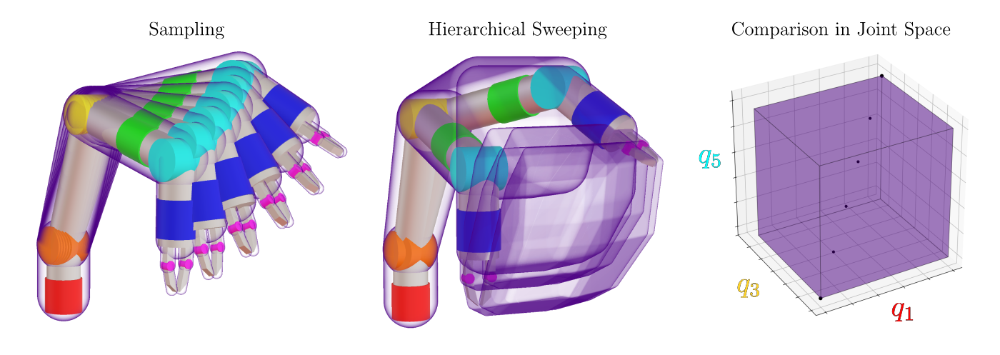
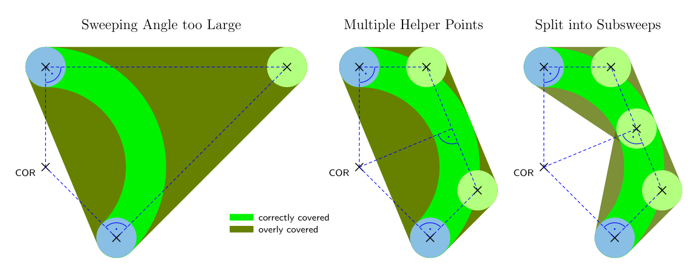

# Hierarchical Sweeping — Discussion

## Avoiding False Positives: Hierarchical Checking

Consider these two fingers:

If the whole gripper moves to the left or to the right, the constructed sweeping volumes of the fingers will intersect and report a collision that cannot happen if the finger joints do not actually move. In contrast to the other false positives this approach can generate, this one is not tolerable as it will happen constantly.

To prevent this, collision checking must happen bottom up in levels: First, only the left finger is checked for collisions. It does not collide as it is just one finger and in robotics we are not enlightened enough to clap with one hand. Same for the second finger. Now we declare that each finger subtree is collision-free and we move up one level. Now we check the entire gripper. Here we check for collisions of all subtrees against each other but not within themselves. If the fingers move too close together, they can collide and we will register that. If they do not, they do not and we will now declare the subtree of the gripper collision-free. Now we can move the whole gripper and just ignore any falsely reported collisions within it.

## Complexity

Each construction of a sweeping volume for a joint motion will multiply the number of points in all subtrees by two for prismatic joints and by at least three for revolute joints. This means when moving a finger capsule (two spheres) using seven consecutive revolute joints will result in a convex hull around 2·3⁷ = 4374 spheres. Fortunately collision-checking this kind of shape is very efficient in bullet but this might still slow things down considerably.

One way to mitigate this issue can be to discard any points along the way that are internal and do not contribute to the convex hull. However, finding these points might prove even more costly. But maybe there is an algorithm that cheaply discards most of the internal points but not all of them.

Another way is to limit the number of simultaneously-actuated joints. RRTConnect can still work quite well if it can only move one or two joints at a time.

## Joint Space Cuboids

Checking motion from one joint state to another using the hierarchical sweeping approach essentially tests the whole axis-aligned cuboid around these states in joint space for collision. Meaning, if no collision is found, it means that any path from start to target (such that each joint value always falls somewhere between its start and target value) is valid. In contrast, when we sample an exact trajectory, only that trajectory is valid, if we did not miss a collision between samples.

This has advantages and disadvantages. The disadvantage is that if any joint state within the cuboid collides, the whole cuboid is rejected. We can however split the trajectory and check subcuboids along the path, but that requires more computation.

An advantage is that it can potentially speed up exploration, as we can add every corner of a free cuboid to the tree/map of valid states per check.

Furthermore, if the environment does not change between planning attempts or the changes can be encapsulated in a small region, we can explore the complete workspace of the robot once as a k-d tree of joint space cuboids and then plan very quickly.

## Large Sweeping Angles

The sweeping approach can test very large joint motions in a single step. However, if the motion becomes too large, the [helper point](../README.md#hierarchical-sweeping) that is constructed from two tangents moves too far out and the enclosed inner concave region can also create numerous phantom collisions. This can be mitigated by adding multiple helper points or by splitting the motion of individual joints and creating multiple convex hulls. Thus, arbitrarily large joint motions can be checked in one go.

## Collision-Freedom Guaranteed*

\* in theory, but not accounting for:
* conceptual oversights in the algorithm
* bugs in the implementation
* floating point precision
* inaccuracies in environment modeling
* deformation of the robot links and joints
* joint control error
